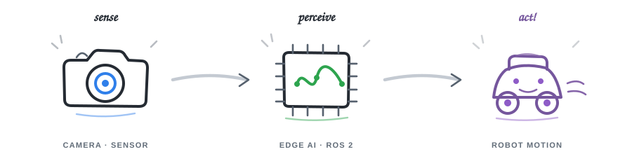

<h1 align="center">현은빈 · Eunbin Hyun</h1>

  카메라와 센서가 읽은 정보를 실제 로봇의 판단과 움직임으로 연결합니다. 
  <strong>Physical AI · Autonomous Robot · Edge Computer Vision</strong>

  

  <a href="./RESUME.md"><strong>이력서 보기</strong></a>
  &nbsp;·&nbsp;
  <a href="https://github.com/eunbin-hyun?tab=repositories"><strong>전체 저장소</strong></a>
  &nbsp;·&nbsp;
  <a href="https://eunbin-hyun.github.io/"><strong>Web Portfolio</strong></a>

## 기술 스택

  <strong>Robotics · Edge</strong> 
  
  
  
  
  

  <strong>AI · Computer Vision</strong> 
  
  
  
  
  

  <strong>Simulation · 3D Design</strong> 
  
  

  <strong>Development · Analysis</strong> 
  
  
  
  

## 대표 프로젝트

<table>
  <tr>
    <td width="50%" valign="top">
      AUTONOMOUS ROBOT · ROS 2 / 2026.07–08 · 6인 팀
      <h3><a href="https://github.com/eunbin-hyun/AprilTag_Nav_Security_Robot">SSACURITY ↗</a></h3>
      
<strong>AprilTag 기반 셔틀 승강장 보안 로봇</strong>

      
Jetson에서 AprilTag 위치 추정과 왕복 경로 상태머신을 구현하고 STM32 UART·관제 WebSocket을 연결했습니다.

      
<strong>담당:</strong> Jetson · AprilTag 자율주행 · 관제 연동

      
<code>ROS 2</code> · <code>Jetson</code> · <code>AprilTag</code> · <code>UART</code>

      
핵심 순수 로직 테스트 <strong>243 passed</strong> · 폐루프 E2E <strong>5/5</strong>

      
<a href="https://github.com/eunbin-hyun/AprilTag_Nav_Security_Robot/tree/main/hardware/jetson/ros2_ws">Jetson 구현 보기 ↗</a>

    </td>
    <td width="50%" valign="top">
      SMART FACTORY · DIGITAL TWIN / 2026.06 · 2인 팀
      <h3><a href="https://github.com/SSAFY-15th-HK/AQIS-for-SmartFactory">AQIS ↗</a></h3>
      
<strong>AI 품질 검사 스마트팩토리</strong>

      
RoboDK 디지털 트윈과 Simulation Dashboard를 만들고, 3D 설계·Roboflow 데이터·YOLO 학습을 담당했습니다.

      
<strong>담당:</strong> Simulation · AI · 3D

      
<code>RoboDK</code> · <code>YOLOv5</code> · <code>Onshape</code> · <code>React</code>

      
<a href="https://github.com/SSAFY-15th-HK/AQIS-for-SmartFactory/tree/main/AQIS-sim">시뮬레이션 구현 보기 ↗</a>

    </td>
  </tr>
  <tr>
    <td width="50%" valign="top">
      EDGE AI · MODEL OPTIMIZATION
      <h3><a href="https://github.com/eunbin-hyun/tangerine_pests_AI">Tangerine Pests AI ↗</a></h3>
      
<strong>감귤 병해충 탐지·방제 로봇</strong>

      
YOLOv8 학습 모델을 ONNX와 HAR로 변환하고, 학습 후 양자화(PTQ)·최적화를 거쳐 Hailo-8L용 HEF로 컴파일했습니다.

      
<strong>담당:</strong> 데이터 · 모델 학습 · NPU 배포 · 하드웨어 통합

      
<code>YOLOv8</code> · <code>Hailo DFC</code> · <code>ONNX</code> · <code>Raspberry Pi 5</code>

      
<a href="https://github.com/eunbin-hyun/tangerine_pests_AI#ai-양자화와-hef-배포">양자화·HEF 배포 과정 보기 ↗</a>

    </td>
    <td width="50%" valign="top">
      COMPUTER VISION · SEGMENTATION
      <h3><a href="https://github.com/eunbin-hyun/Night_Rain_Lane_Segmentation">Night &amp; Rain Lane ↗</a></h3>
      
<strong>야간·우천 차선 분할 시스템</strong>

      
편광필름과 CLAHE로 반사광·저조도 문제를 완화하고 YOLO11n-seg를 Raspberry Pi에 통합했습니다.

      
<strong>담당:</strong> 팀장 · 데이터 · 모델 학습 · 임베디드 추론

      
<code>YOLO11</code> · <code>OpenCV</code> · <code>CLAHE</code> · <code>Picamera2</code>

      
기존 모델 대비 Recall <strong>28.7% ↑</strong> · mAP50 <strong>11.2% ↑</strong>

      
<a href="https://github.com/eunbin-hyun/Night_Rain_Lane_Segmentation/blob/main/main_clahe.py">전처리·추론 코드 보기 ↗</a>

    </td>
  </tr>
</table>

## 추가 프로젝트

- **[SafePro+ ↗](https://github.com/eunbin-hyun/Worker_Safety_AI)** — MediaPipe·LSTM 자세 인식과 YOLOv8 안전모 탐지를 결합한 노동자 안전관리 프로토타입 · 6인 팀 · 담당: 프론트엔드, 아이디어 기획·발표, AI 구조 제안
- **[Arduino Line Tracer ↗](https://github.com/eunbin-hyun/Arduino_Line_Tracer)** — 적외선·초음파 센서와 서보모터를 활용한 라인 추적·장애물 회피 로봇 · 담당: 모터 제어 및 센서 기반 주행 로직 · 팀 2위
- **[MATLAB Audio Similarity Analysis ↗](https://github.com/eunbin-hyun/MATLAB_Audio_Similarity_Analysis)** — 원곡 음원과 실제·모창 가수의 유사도를 상관계수·RMSE·PSNR로 비교한 디지털신호처리 프로젝트 · 담당: 프로젝트 기획 총괄 및 PSNR 분석

## 제가 맡아 온 일

- **Autonomous Navigation** — AprilTag 기하 기반 위치 추정, 왕복 경로 상태머신, FAULT/HOLD 안전 상태 설계
- **Edge AI Deployment** — PyTorch → ONNX → HAR → PTQ → HEF 변환과 Raspberry Pi·Hailo NPU 배포
- **Computer Vision** — YOLO 탐지·분할, 데이터 라벨링, CLAHE 전처리, RealSense·Picamera 영상 처리
- **Simulation & 3D** — RoboDK 공정 시뮬레이션, Simulation Dashboard, Onshape 부품 설계와 3D 프린팅
- **Hardware Integration** — Jetson–STM32 UART, ROS 2 노드, 센서·카메라·로봇 제어 연결

## 수상 · 연구

| 연도 | 구분 | 내용 |
|---|---|---|
| 2025 | 학술대회 | 한국전기전자학회 하계학술대회 제1저자 발표 — [야간 및 악천후 환경에서의 딥러닝 기반 실시간 차선 인식 시스템 ↗](https://github.com/eunbin-hyun/Night_Rain_Lane_Segmentation/tree/main/docs/raspberry-pi) |
| 2025 | 학술대회 | 제27회 전자정보통신 학술대회 제1저자 발표 — [야간 및 악천후 환경에서의 차선 인식용 세그멘테이션 모델 비교 ↗](https://github.com/eunbin-hyun/Night_Rain_Lane_Segmentation/tree/main/docs/jetson-orin-nano) |
| 2025 | 수상 | 2025-1학기 캡스톤디자인 결과발표회 우수상 |
| 2025 | 특허 | [감귤 병충해 실시간 진단 및 예방 장치 ↗](https://github.com/eunbin-hyun/tangerine_pests_AI/tree/main/docs) 출원 (`10-2025-0016861`) |
| 2024 | 수상 | 제32회 설계 및 팀프로젝트 작품전시회 최우수상 |
| 2024 | 수상 | IP 창의발명 경진대회 동상 · 캡스톤디자인 결과발표회 장려상 |

## 학습 기록

- [AlgorithmTest_practice](https://github.com/eunbin-hyun/AlgorithmTest_practice) — 백준·프로그래머스·SWEA·Codetree 문제 풀이
- [CodeUp_Algorithm](https://github.com/eunbin-hyun/CodeUp_Algorithm) — CodeUp 문제 풀이
- [studyPy](https://github.com/eunbin-hyun/studyPy) · [Pyton_Team_Notes](https://github.com/eunbin-hyun/Pyton_Team_Notes) — Python 학습과 팀 노트

  센서 입력에서 모델 추론, 임베디드 최적화, 로봇 동작까지 이어지는 시스템을 만들고 있습니다.

